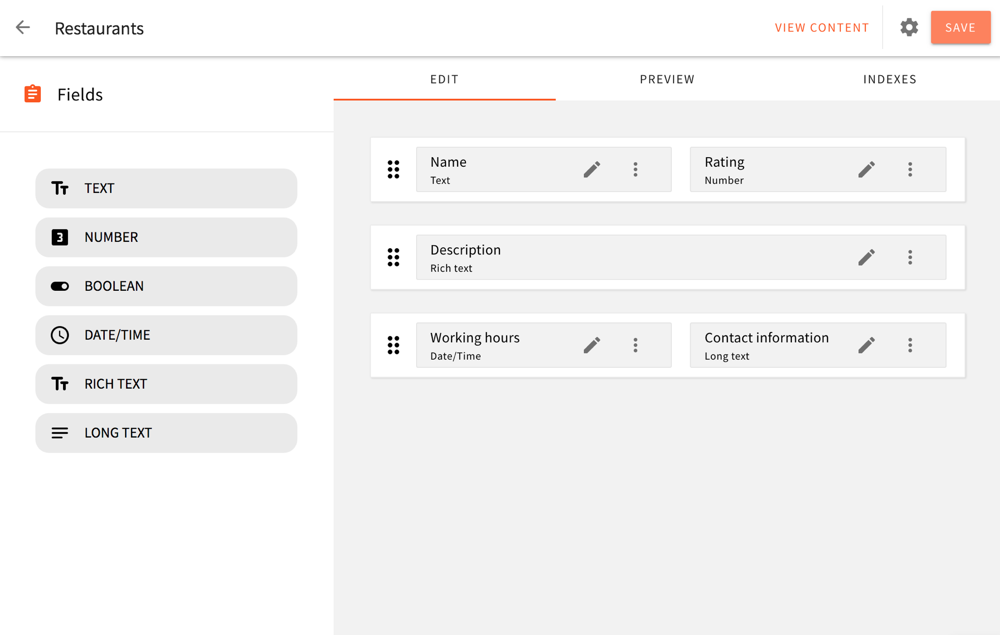
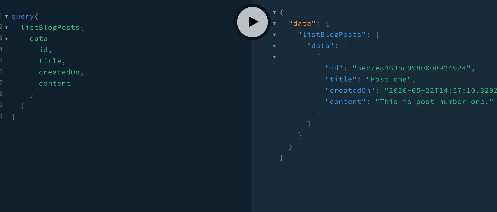
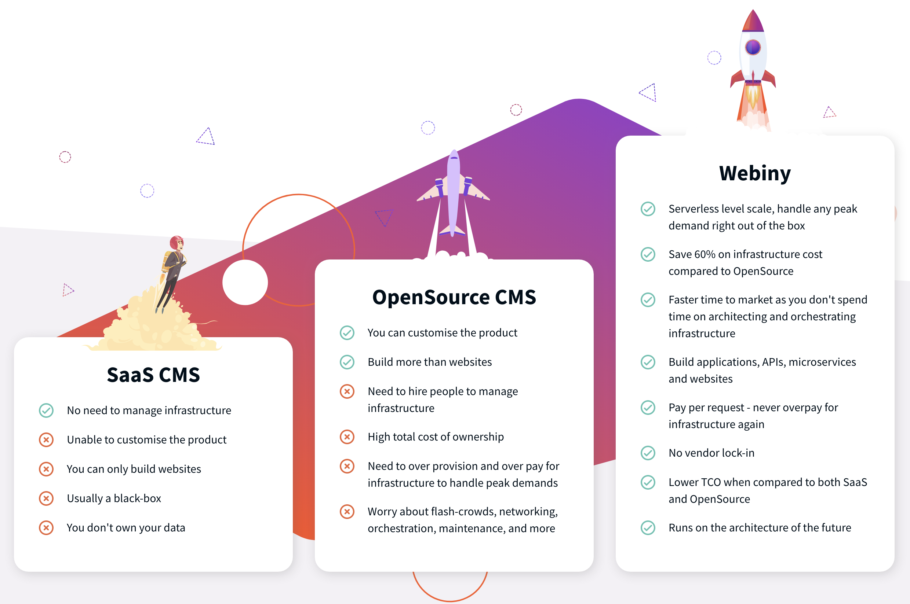

### **Does a Serverless Headless CMS exist? It does now!**

## Launching Serverless Headless CMS by Webiny

### After several months of development, testing and iterations we are thrilled to announce the availability of Webiny Serverless Headless CMS (beta). It’s the first serverless headless CMS on the market that’s also open-source and self-hosted.

Have a look below on what’s included and how you can start using it today.

## Webiny Story

When we started building [Webiny Page Builder](https://www.webiny.com/serverless-app/page-builder) in 2018, we didn’t know if that was even possible, given the serverless market was in its early days and there was a limited resource available in terms of guides and tutorials. Almost non-existent when it came to building a full-stack serverless web application.

Going through many trials and errors, we managed to pioneer several best practices and approaches in this space. Just check out our [architecture docs](https://docs.webiny.com/docs/deep-dive/architecture/overview) and the linked blog posts inside.

Once we got comfortable with the possibilities of Webiny and our [Serverless Web Development Framework](https://www.webiny.com/serverless-web-development-framework), we knew the time is right to build, and now launch, our flagship product, [Serverless Headless CMS](https://www.webiny.com/serverless-app/headless-cms/).

## Serverless Headless CMS

### Why we built it?

When you look at the headless CMS market, there are several options you can choose from, but none of the options are both serverless and open-source at the same time. Half of them run on “traditional” infrastructures, like virtual machines, and the other half is made of standard SaaS products.

We wanted to build something that scales to handle huge amounts of traffic out of the box, no matter how spikey. At the same time, we wanted a solution that is customizable and has zero overhead when it comes to managing infrastructure. Today, this is only achievable with serverless infrastructure.

### So what’s inside the package?

✅ **Powerful content modelling interface** — not only you model your content, but also build the interface for how the input forms will look like to your content editors. Place form inputs inside a grid layout and split it into multiple columns and rows.

✅ **Content localization** — a simple and intuitive way to input and serve content in multiple languages. We keep the interface for editors clean and easy to use, no matter if you have 1 language or 20 languages.

**✅ GraphQL API** — The API is at the core of every headless CMS. If you get the API wrong, the whole product has a poor experience. This is why we spent a significant part of our effort on ensuring developers have a great experience using our API. The API also comes with a built-in GraphQL playground, so it’s super simple to inspect your schema and test your queries.

**✅ Environments and aliases **— With a single click copy your existing data into a new environment. Modify it and update it without affecting your production site. Finally, remap the alias to switch the new environment into production. With this approach, you get instant rollback feature as well as there is no need to update and redeploy your code to any of your devices when you make changes.

**✅ Customizable and extendable platform with a microservices architecture **— Having a headless** **CMS is great, but what if it only gets you halfway? What if you need to build custom code, add logic with specific rules that are outside the scope of the headless CMS. This is where Webiny shines. Using the [Serverless Web Development Framework](https://www.webiny.com/serverless-web-development-framework) you can build any type of logic your project requires and deploy it alongside the headless CMS as a separate microservice.

..and much more. For a full set of features check out the [product landing page](https://www.webiny.com/serverless-app/headless-cms).

### But there are already existing solutions like Contentful, Strapi, GraphCMS and others, how do you differ?

**Webiny vs a SaaS Headless CMS (Contentful, GraphCMS …)**When it comes to the SaaS offerings in the headless CMS space, it’s a pretty crowded market.

The advantage of a SaaS solution (although they also refer to themselves sometimes as “serverless”) is that they internally have a team of people to manage the infrastructure for you. So you don’t need to worry about the scale and maintenance factor.

The tradeoff you’re making by choosing SaaS is that you’re basically working with a product that you have no control over. You cannot modify the product to fit your requirements and you can’t use it to build other custom modules on top.

When you compare that to Webiny, which is open-source, you get the ability to fully extend and customize the system to fit your needs. Because Webiny runs in your own AWS cloud on top of the serverless platform, you don’t need to manage the infrastructure to have a great scale and be able to handle peak demands.

**Webiny vs an OpenSource Headless CMS (Strapi)**With the open-source offering, developers get the full control and ownership of the system, but the TCO (total cost of ownership) of such a system in many cases can be higher than a SaaS product.

The reason is that you need to hire several devops and network engineers to manage, scale and operate the infrastructure for you. This is because all the current open-source solutions are designed to run on top of a traditional virtual machine or container infrastructure.

In addition to the human-cost, you often have to over-provision the infrastructure and pay for the parts you are not utilizing, to be able to handle peak demands.

In essence with open-source, you trade the scalability for customization but at a higher cost factor.

When it comes to Webiny again, being serverless brings you the scale, but at a zero cost increase, and at the same time you don’t lose any of the open-source benefits.

### Webiny vs Netlify CMS

Netlify CMS is a great solution but it lacks many of the features you’ll find in Webiny. Netlify CMS caters for more simple sites. For example in Netlify CMS, a feature like content modelling is done code and configuration files. There is no multi-language support, no environments and aliases. Managing users and permissions is very rudimentary.

If you have even a slightly more advanced use-case, with Netlify CMS you might have a hard time getting it done.

Unlike Netlify CMS, Webiny is designed for both simple tasks as well as a complex one. Webiny provides you with all the features you will need to successfully deliver your project.

## Get Started

To get started with Webiny Serverless Headless CMS head over to our get started tutorial: [https://docs.webiny.com/docs/get-started/quick-start](https://docs.webiny.com/docs/get-started/quick-start)

## Support the Project

If you love what we’re building here, we would appreciate if you would show us your support by either [contributing](https://github.com/webiny/webiny-js/blob/master/CONTRIBUTING.md) or [starring](https://github.com/webiny/webiny-js/stargazers)(★) our repository. This is what keeps us going!

Please tweet and share this news if you liked what we had to share.