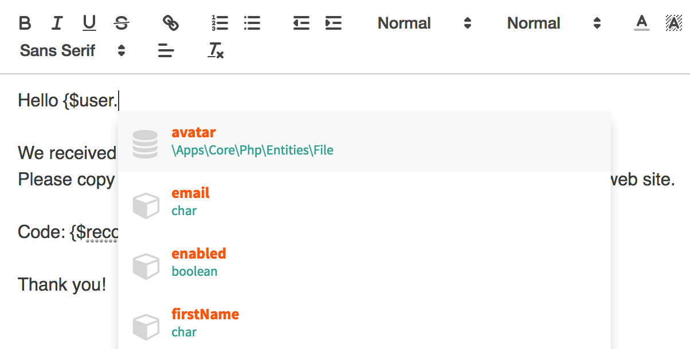

Be honest, how many times have you found yourself in this situation? You either accidentally emailed a real customer or had a mistyped variable in an email and the customer received either an empty field or the variable name instead of the proper value?

This kind of a situation definitely doesn’t look good for you, your team, your business or your end customer. I’ve been in your shoes before, and I’ve learned a new lesson each time; a very hard lesson. :(

So, here are a few of the most common pitfalls to watch out for:

## Testing with real emails. Seriously, don’t do that!

I know there are cases when you need to download the production database and do the testing, because a certain bug can’t be otherwise replicated. In general, that’s very poor practice so try to avoid it, if possible.

However, this cannot always be avoided. Below are some tips on how to protect yourself:

#### TIP#1**: It would be useful to have an export/import script which would obfuscate users’ emails before doing the local import. This will save you from making the mistake of emailing real customers while testing.

**TIP#2**: It’s also good to have a “development” flag within the script that sends the emails or pushes them to Sendgrid, SES or some other third party to change the recipient of your email to your own email. This way all emails will be re-routed to your inbox.

## Not proofreading email templates. Hi *|NAME|*

As developers we tend to create a new email template with some dummy text and then ship it to the marketing team to add the copy, often without checking if they’ve introduced a new variable or changed some of the existing ones. This can reflect in a way that the final email content is either missing certain information or the customer sees these strange variables.

**TIP#1**: As a safety measure, detect if there are still un-parsed variables in the email and block those from going out. Alternatively, you want to somehow alert your team about the issues.

**TIP#2**: Depending on the control you have over the tool where you write the initial email content, you might want to have autocompletion of possible variables and throw exceptions if somebody has added a variable that is not supported.

## **Rate limit the sending. Oops… we sent 100+ emails to a single user

Sometimes testing in development doesn’t pick up all the bugs. You might have a too small set of users in the database to identify a bug. Sometimes you might not count how many test emails you’ve received vs how many you expected to receive.

I remember a case where a developer created a reminder that lists all users that haven’t confirmed their account and then sends them an email. In the actual code loop, the recipients of the email were appended and caused the first user in the loop to receive over 100 emails. Big problem.

In the development the test only had two users who were involved in the scenario, and since the functional test was conducted several times, nobody counted actually how many emails were in the inbox. You could argue it was a poorly executed test, and I would agree.

**TIP**: Rate limit the number of emails a single email address can receive in a specific time period, e.g. two emails in 120 sec, or whatever you feel comfortable with. You might also want to set some “burst protection,” e.g. if you see a sudden big increase in the number of emails that are queued for that address, you might want to pause them and inspect them.

## Conclusion

It’s difficult … I don’t think there is a silver bullet that will take away all these problems. I’m curious to hear if any of you have more best-practices or advice to share… I’m keen on learning more about other approaches.

### Notification Manager

At Webiny, we’ve built our own system for managing transactional emails where we’ve implemented all the above mentioned tips. As we learn more about this area, we’ll improve the tool.

If you’re interested in using our tool, it’s free and open source. You can learn more about it on our website:

[https://www.webiny.com/apps/notification-manager](https://www.webiny.com/apps/notification-manager)