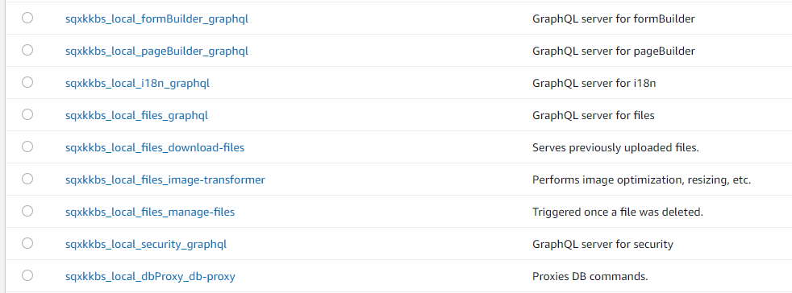
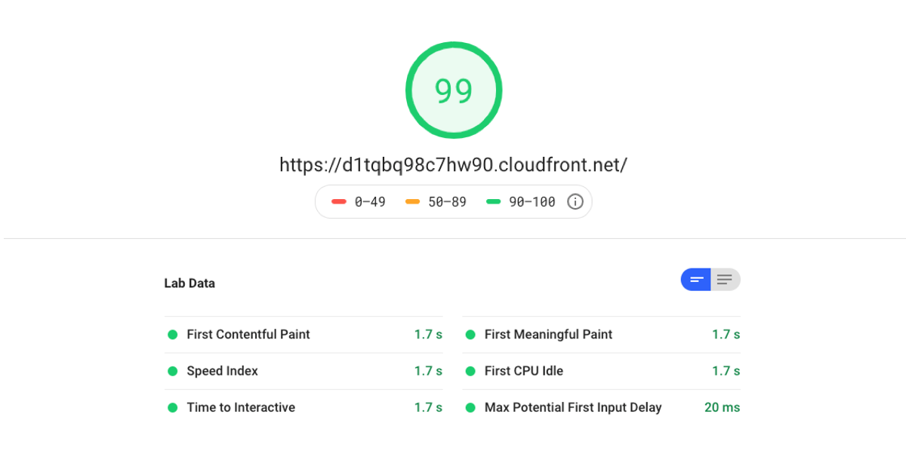
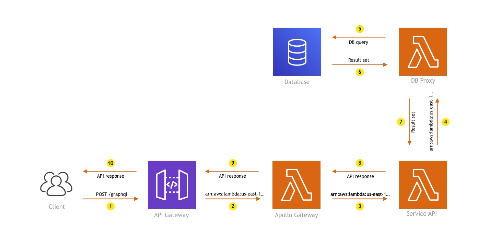
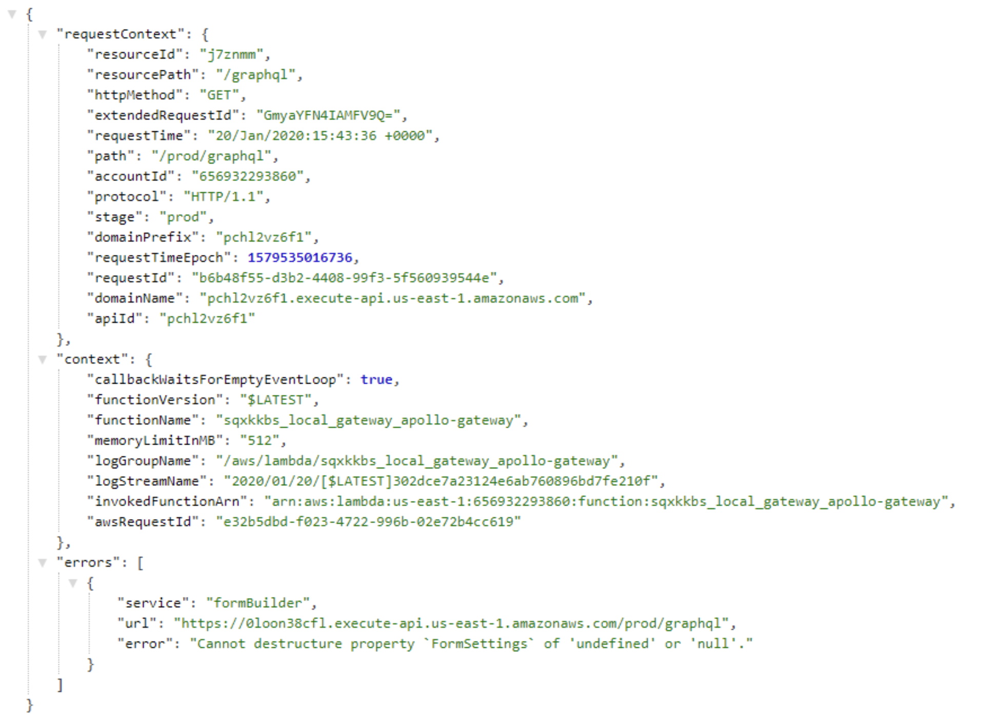
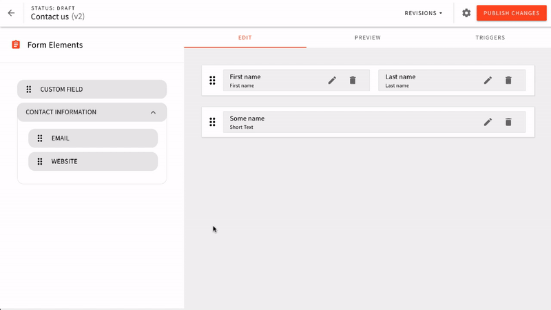

**Webiny** has a simple goal — to empower developers to create serverless apps. With this focus and several exciting updates, we are entering the 2020 with a new release, one that focuses on improving the developer experience and improving the performance of your Webiny powered websites.

## 👥 New Contributors

Let’s start the update by giving a shout out to our new contributors 👏

**[Roman](https://github.com/roman-vabishchevych)** and his team have been successfully using Webiny in production for a while now. He provided us with great feedback and also several contributions in terms of plugins for Webiny page builder. The plugins will be available on a newly launched plugin repository page in the upcoming weeks.

**[fodurrr](https://github.com/fodurrr)**helped us trace a few bugs and also actively engaged in several discussions on our GitHub.

**[jamesgeorge007](https://github.com/jamesgeorge007)** from [Mad.Hacks](https://github.com/madlabsinc) contributed several PRs improving the DX of our webiny CLI.

**[jbampton](https://github.com/jbampton)** reviewed several of our readmes and helped to polish it out.

### 🤝 Get Involved

Webiny is a young project, but we have already gained great interest from the community. Just the fact that we have received over 1700 GitHub stars in such a short time, we feel, is amazing.

We encourage everyone to get involved and contribute, regardless of their experience level. Read the [contributing guide](https://github.com/webiny/webiny-js/blob/master/CONTRIBUTING.md) and if you still run into problems, just give us a ping on [Gitter](https://gitter.im/Webiny/webiny-js), we will help you out.

## ⭐ Webiny Showcase

This is a new section we want to start. In case you or your company is using Webiny, we would love to showcase it on our blog, website, social channels and our newsletter. To apply -> [get in touch](https://www.webiny.com/contact-us).

## Product Improvements

### ✅ DX: Improved naming of resources

Previously when you would deploy Webiny resources, the resource names only contained some random ID, which wasn’t much of a help to figure out what that resource is doing. We have now changed that. A resource name is much clearer and actually provides some useful information. Resource name now follows a pattern of **{project-id}-{environment}-{service-name}**.



### ✅ DX: Replaced Flow with TypeScript

TypeScript brings many added benefits over Flow. We had this task on our list for a while and finally decided to take a stab at it. Now, while coding, you will benefit from having a more accurate autocomplete in your editor, as well as many types that Webiny exposes. And not only Webiny; most of our dependencies (like Apollo, React, etc.) have TypeScript declarations so it is now much easier to make use of those and make your code even more readable and easy to navigate.

### ✅ DX: Refactored how themes work

We moved away from an approach of having a “central” theme for all your Webiny apps. With this update, every app and a plugin can register its own theme. This way the Webiny Page Builder has one theme, Webiny Form Builder has another theme and so on. This makes the code much cleaner and more flexible as a theme is nothing more than a collection of plugins.

### ✅ UX: Page load time improvements

Serving pages as fast as possible and with great SEO support is one of our top priorities. That’s why we’ve invested more time into improving the page load speed, by doing additional optimizations on the backend serving and caching mechanisms. I’m happy to report that the results are amazing, you should see your pages load in ~1s on average.



The details of our implementation are documented in this GitHub issue: [https://github.com/webiny/webiny-js/issues/622](https://github.com/webiny/webiny-js/issues/622)

### ✅ UX: Page prefetching

While the improvements in page load times are important, we also wanted to speed up page transitions, which occur while the user is navigating your site in the browser. Once a user lands on one of your pages, a background process will collect all links that point to other pages of your website, and asynchronously fetch their content. This way, when the user clicks on a link, he will no longer see a loading indicator but will be instantly redirected, which produces a much smoother UX. This feature is enabled by default in every new Webiny deployment, no additional configuration needed!

### ✅ DX: Introduced DB Proxy

In this release, we are also introducing the **DB Proxy Lambda function**, which is, as you can probably tell by its name, a Lambda function that serves as a database connection proxy. In other words, from now on, the database connection establishment won’t be happening in every function that needs to talk to the database, this is now delegated to the DB Proxy Lambda function. And every time a function actually needs to talk to the database, it will just invoke the DB Proxy Lambda function, which will execute the query on the caller’s behalf, and respond back with the results.

The following diagram shows how the DB Proxy Lambda function operates:



By implementing this way of handling database connections, we’ve noticed a significant reduction in the number of active and *zombie* database connections. Additionally, this also enables us to limit the maximum number of connections by adjusting the DB Proxy Lambda function’s concurrency limit. We’ve set this limit to 15, meaning a maximum of 15 DB Proxy Lambda function instances may be present at the same time. But you can adjust it for your needs, via your `/api/serverless.yml` and `/apps/serverless.yml `files, by changing the `concurrencyLimit` param:

```
dbProxy:
  component: "@webiny/serverless-db-proxy"
  inputs:
    concurrencyLimit: 15
    env:
      MONGODB_SERVER: ${vars.mongodb.server}
      MONGODB_NAME: ${vars.mongodb.name}
```

### ✅ DX: Improved error reporting

Instead of the infamous `Internal server error` message, which doesn’t tell you anything, now you will receive a more useful report back when an error happens. For production, you can turn off error reporting so you don’t expose any information you don’t want your users to see.



### ✅ New App: Webiny Form Builder

For the ones that missed this release — Webiny Form Builder is now available.



To learn more about Webiny Form Builder read the launch blog post here: [https://blog.webiny.com/launching-webiny-serverless-form-builder-eac50948174f](/blog/launching-webiny-serverless-form-builder-eac50948174f)

## ⬆️ Try the Latest Release

In case you already have webiny CLI installed, simply create a new project and then deploy it to your cloud provider.

```
webiny create my-projectcd my-projectwebiny deploy-apicd apps/adminyarn start
```

In case you don’t have webiny CLI installed, please follow this quick start tutorial: [https://docs.webiny.com/docs/get-started/quick-start](https://docs.webiny.com/docs/get-started/quick-start)

In case you want to migrate an existing project to the latest release, there shouldn’t be any breaking changes, but in case of any problems, you can reach us on [GitHub](https://github.com/webiny/webiny-js).

## Join Our Team

Yes, we are hiring! Check out the open positions on our job portal => [careers.webiny.com](https://careers.webiny.com)

Finally, help us spread the word about this release by applauding 👏 the post and spreading the word on twitter.