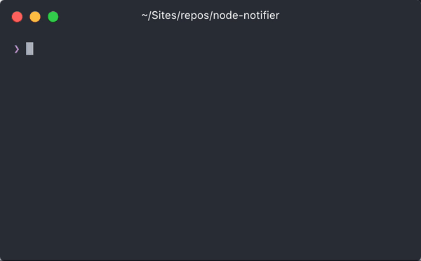

At Webiny we do have the `package-of-the-day` slack channel where we post our favorite NPM packages daily 🙃

Below, we listed our top 10 favorite NPM packages. 🚀

## 1. Contreebutos

`Contreebutors` — A small library that makes it easy to keep a list of all people that contributed to a project (most often an open-source project). It’s really easy to use — just run the `contreebutors add --username {GITHUB_USERNAME}` command and the tool will add the given contributor to the `contreebutors.json` file, and more importantly, update the list of all contributors at the end of your project's `README.md` file.

## 2. Githug

`Githug` — Is designed to give you a practical way of learning git. It has a series of levels, each requiring you to use git commands to arrive at a correct answer.

## 3. Indent-string

`Indent-string` — Is very useful when you want to add a little bit of touch to your CLI messages. It indents your multi-line text by a given number of spaces. You can also specify which character to use as an indentation character.

## 4. Gatsby-source-graphql

`Gatsby-source-graphql`— A plugin for connecting arbitrary GraphQL APIs to Gatsby’s GraphQL. Remote schemas are stitched together by declaring an arbitrary type name that wraps the remote schema Query type (`typeName` below), and putting the remote schema under a field of the Gatsby GraphQL query (`fieldName` below).

## 5. Adio

[Adio](https://www.npmjs.com/package/adio) (all-dependencies-in-order) — This is a small library that checks your code for dependencies that are not listed in the package.json and vice-versa, checks package.json files for dependencies that are not used in code.

## 6. ENV-CMD

`Env-cmd` — A simple node program for managing your environment variables using different file formats and programmatic API.

## 7. NCP

[NCP](https://www.npmjs.com/package/ncp) — Asynchronous recursive file & directory copying. Think `cp -r` but pure node, and asynchronous. `ncp` can be used both as a CLI tool and programmatically.

## 8. Node-notifier

`Node-notifier` — Send cross-platform native notifications using Node.js. Notification Center for macOS, `notify-osd`/`libnotify-bin` for Linux, Toasters for Windows 8/10, or taskbar balloons for earlier Windows versions. Growl is used if none of these requirements are met. [Works well with Electron](https://www.npmjs.com/package/node-notifier#within-electron-packaging).

## 9. NeDB

[NeDB](https://github.com/louischatriot/nedb/) — The JavaScript Database — Embedded persistent or in-memory database for Node.js, nw.js, Electron, and browsers, 100% JavaScript, no binary dependency. API is a subset of MongoDB’s and it’s [plenty fast](https://github.com/louischatriot/nedb/#speed).

## 10. Chokidar

`Chokidar` — This package is your go-to tool when you need to watch for file system changes. It’s very useful for creating file watchers. Many tools are built using this library, one of the most well-known being `webpack` and its `webpack-dev-server`.